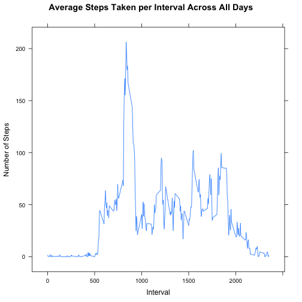
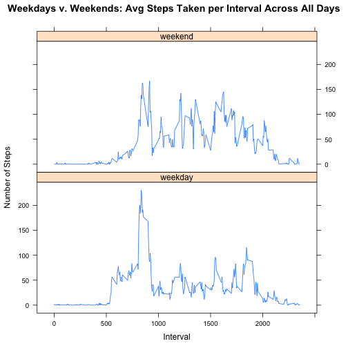

# Reproducible Research: Peer Assessment 1

## Loading and preprocessing the data
This following code sets the working directory and reads the Peer Assessment 1 data.
  

```r
      setwd("~/RepData_PeerAssessment1-1")
      myData <- read.csv("./activity.csv")
```

## What is mean total number of steps taken per day?

This code sums the steps by date and then creates a historgram

```r
            SumByDate <- aggregate(myData$steps, by=list(date=myData$date), FUN=sum, na.rm=TRUE)
            hist(SumByDate$x, main="Histogram of the Total Number of Steps Each Day", xlab="Sum of Steps by Date")
```

 
  
This code calculates and reports the mean of the sum of steps by date.

```r
      AvgByDate <- aggregate(myData$steps, by=list(date=myData$date), FUN=mean, na.rm=TRUE)
      mean(AvgByDate$x, na.rm=TRUE)
```

```
## [1] 37.38
```
  
This code reports the median of the sum of steps by date.

```r
      median(AvgByDate$x, na.rm=TRUE)
```

```
## [1] 37.38
```
## What is the average daily activity pattern?
  
This code calculates the average steps per interval across all days and then creates  
a time series plot.

```r
      library(lattice)
      StepAvgByInterval <- aggregate(myData$steps, by=list(interval=myData$interval), FUN=mean, na.rm=TRUE)
      xyplot(StepAvgByInterval$x ~ StepAvgByInterval$interval, 
             main="Average Steps Taken per Interval Across All Days", 
             ylab="Number of Steps", xlab="Interval",
             StepAvgByInterval, 
             type="l")
```

 
  
This code will calculate the 5-minute interval, on average across all the days in the dataset,
that contains the maximum number of steps.  

```r
      StepAvgByInterval[StepAvgByInterval$x==max(StepAvgByInterval$x),1] 
```

```
## [1] 835
```

## Imputing missing values

This code calculates and reports the total number of missing values in the dataset.

```r
      sum(is.na(myData$steps))
```

```
## [1] 2304
```

This code creates a new dataset that is equal to the original dataset but with the missing data filled in with the average for that interval.  Do these values differ? Yes, it appears that the frequency of inervals with sums that were in the range of 0 to 1000 decreased significantly.  Most of those counts presumably went to the highest range of 10,000 to 15,000, which inscesed significantly.  The impact is that the most common range increased more than the others.


```r
library(plyr)
impute.mean <- function(x) replace(x, is.na(x), mean(x, na.rm = TRUE))
myData2 <- ddply(myData, ~ interval, transform, steps = impute.mean(steps))

myData2 <- myData2[order(myData2$date), ]
```
This code sums the steps by date and then creates a historgram.

```r
            SumByDate <- aggregate(myData2$steps, by=list(date=myData2$date), FUN=sum, na.rm=TRUE)
            hist(SumByDate$x,
                 main="Histogram of the Total Number of Steps Each Day", xlab="Sum of Steps by Date")
```

 
  
This code calculates and reports the mean of the sum of steps by date.

```r
      AvgByDate2 <- aggregate(myData2$steps, by=list(date=myData2$date), FUN=mean, na.rm=TRUE)
      mean(AvgByDate2$x, na.rm=TRUE)
```

```
## [1] 37.38
```
  
This code reports the median of the sum of steps by date.

```r
      median(AvgByDate2$x, na.rm=TRUE)
```

```
## [1] 37.38
```

## Are there differences in activity patterns between weekdays and weekends?

This code modfies the date column from factor to Date class and then adds a new column with either “weekday” and “weekend”. 

```r
      myData2$date <- as.Date(myData2[,2], format = "%Y-%m-%d")
      myData2$Day <- ifelse(weekdays(myData2$date) %in% list('Saturday','Sunday'),"weekend", "weekday")
```

This code makes a panel plot containing a time series plot (i.e. type = "l") of the 5-minute interval (x-axis) and the average number of steps taken, averaged across all weekday days or weekend days (y-axis).  The data set (with no missing data values) is first divided into two data frames (one for weekend days and one for weekday days).  That allows us to easily get the step average per interval for each grouping.  Once aggregated to find the means, the two resulting data frames are combinded where xyplot function is utilized to create the plot.


```r
      WeekendsSubset <- subset(myData2, myData2$Day == "weekend")
      WeekdaySubset <- subset(myData2, myData2$Day == "weekday")
      
      StepAvgByIntervalWE <- aggregate(WeekendsSubset$steps, 
                                       by=list(interval=WeekendsSubset$interval), 
                                       FUN=mean, na.rm=TRUE)
      StepAvgByIntervalWE$Day <- "weekend"
      
      StepAvgByIntervalWD <- aggregate(WeekdaySubset$steps, 
                                       by=list(interval=WeekdaySubset$interval), 
                                       FUN=mean, na.rm=TRUE)
      StepAvgByIntervalWD$Day <- "weekday"

      combined <- rbind(StepAvgByIntervalWE, StepAvgByIntervalWD)
     
      xyplot(combined$x ~ combined$interval|combined$Day, 
            main="Weekdays v. Weekends: Avg Steps Taken per Interval Across All Days", 
            type="l",
            ylab="Number of Steps", 
            xlab="Interval",
            layout=c(1,2))
```

 
